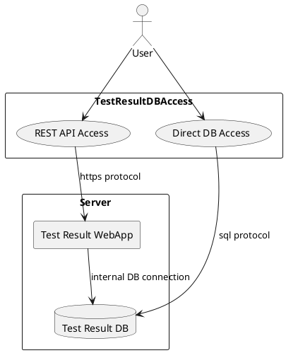
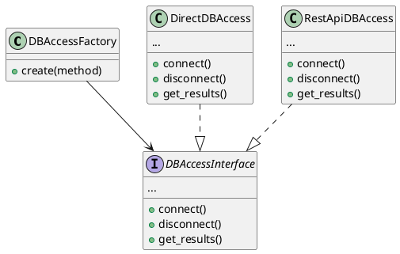
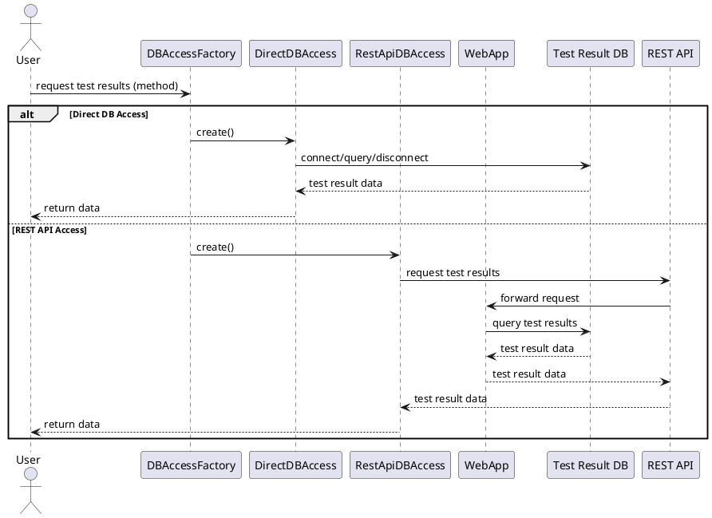
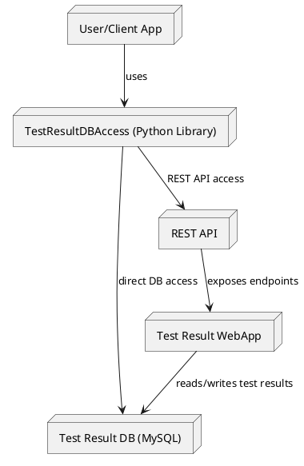

# Software Architecture Design Document

## 1. Introduction
- Purpose of the document
	This document describes the software architecture of the TestResultDBAccess package, outlining its structure, components, and design decisions.

- Scope of the system
	TestResultDBAccess provides flexible and efficient access to the database of a test result web application, supporting both direct database access and REST API access.

- Definitions, acronyms, and abbreviations
	- TestResultDBAccess: The Python package for accessing test result databases
	- REST API: Representational State Transfer Application Programming Interface
	- PyPI: Python Package Index
	- GenPackageDoc: Documentation generator tool

## 2. System Overview
- High-level description of the system
	TestResultDBAccess is a Python package designed to interact with test result databases, enabling users to retrieve, store, and manage test results efficiently. It supports both direct database connections and RESTful API communication, making it suitable for various deployment scenarios.

- Main goals and objectives
	- Provide a unified interface for accessing test result data
	- Support multiple access methods (direct and REST API)
	- Facilitate integration with test result web applications
	- Ensure extensibility and maintainability

### Use Case Diagram (PlantUML)

## 3. Architectural Representation

PlantUML Diagram

- Description of architectural style/patterns used
    - Factory Pattern: The DBAccessFactory class is used to instantiate the appropriate database access class (DirectDBAccess or RestApiDBAccess) based on the user's choice of access method.
    - Interface-Based Design: Both access classes implement a common interface (DBAccessInterface), ensuring consistent method signatures and behavior.
    - Separation of Concerns: Direct database access and REST API access are handled by separate classes, making the system extensible and maintainable.

## 4. System Components
- Major Components/Modules

	- **DBAccessFactory**
		- Responsible for creating instances of database access classes (`DirectDBAccess` or `RestApiDBAccess`) based on the specified access method.
		- Implements the Factory design pattern to abstract the instantiation logic.

	- **DBAccessInterface**
		- An abstract base class that defines the required interface for database access.
		- Specifies methods such as `connect()`, `disconnect()`, `get_results()`, and others for interacting with the database.

	- **DirectDBAccess**
		- Implements `DBAccessInterface` for direct interaction with the test result database (e.g., MySQL).
		- Handles connection management, query execution, and data retrieval directly from the database.

	- **RestApiDBAccess**
		- Implements `DBAccessInterface` for interaction with the test result web application's REST API.
		- Manages HTTP requests, authentication, and data retrieval via RESTful endpoints.

	- **version.py**
		- Maintains version information for the TestResultDBAccess package.

- Responsibilities

	- **DBAccessFactory:** Decides which access method to use and returns the appropriate object.
	- **DBAccessInterface:** Ensures a consistent API for all database access implementations.
	- **DirectDBAccess:** Provides direct database operations and manages database connections.
	- **RestApiDBAccess:** Provides REST API operations and manages HTTP communication.
	- **version.py:** Tracks and exposes the current version of the package.

## 5. Data Flow and Control Flow
- Data Flow

	- The user/client requests test result data.
	- The request is sent to `DBAccessFactory`, which selects the access method.
	- `DBAccessFactory` creates either a `DirectDBAccess` or `RestApiDBAccess` instance.
	- The selected access class connects to the data source (database or REST API) and retrieves the data.
	- The data is returned to the user/client.

- Control Flow

	- The user/client calls a method to access test results.
	- The factory pattern abstracts the selection and instantiation of the access class.
	- The access class manages connection, data retrieval, and disconnection.
	- Error handling and authentication are managed within the access classes.

- Sequence Diagram (PlantUML)

## 6. Interface Design

- Internal Interfaces (between components)

	- **DBAccessFactory → DBAccessInterface**
		- The factory creates and returns objects that implement the `DBAccessInterface`.
		- All access classes (`DirectDBAccess`, `RestApiDBAccess`) must implement the methods defined in the interface, such as `connect()`, `disconnect()`, and `get_results()`.

	- **DirectDBAccess / RestApiDBAccess**
		- Both classes provide a consistent API for database operations, regardless of the underlying access method.
		- Internal methods handle connection management, query execution, and error handling.

- External Interfaces

	- **User/Client API**
		- The package exposes a unified API for users to interact with test result databases.
		- Users can choose the access method (direct or REST API) and call methods to retrieve, store, or update test results.

	- **REST API Integration**
		- When using `RestApiDBAccess`, the package communicates with the test result web application's REST API.
		- Handles authentication, request formatting, and response parsing.

	- **Database Integration**
		- When using `DirectDBAccess`, the package connects directly to the database (e.g., MySQL) using standard database drivers.

## 7. Deployment Architecture
- Physical Deployment Diagram

The package is typically deployed as a Python library, either installed via PyPI or directly from the source repository.
It can be integrated into test automation environments, CI/CD pipelines, or standalone scripts.

PlantUML Deployment Diagram

- Description of Hardware, Network, and Software Environment

	- **Hardware:** Runs on any system supporting Python (Windows, Linux, macOS).
	- **Network:** Requires network connectivity to the database server or REST API endpoint.
	- **Software:** Requires Python 3.x, relevant database drivers (e.g., MySQLdb), and HTTP libraries (e.g., requests).
	- **Integration:** Can be used in local, virtual, or cloud environments.

## 8. Security Architecture
- Security Requirements
	- Protect sensitive test result data from unauthorized access.
	- Restrict direct database access from outside the secure network zone.
	- Ensure secure communication between components (e.g., via HTTPS for REST API).

- Security Mechanisms and Design Decisions
	- The database is placed inside a security zone (e.g., a protected subnet or DMZ) to prevent direct access from external networks.
	- Direct database access is only allowed within the security zone (e.g., internal services or trusted users).
	- For users or systems outside the security zone, access to test result data is provided via the REST API exposed by the Test Result WebApp.
	- The REST API acts as a secure gateway, enforcing authentication, authorization, and logging, and only exposes necessary data and operations.
	- All REST API communication should use secure protocols (HTTPS) to protect data in transit.
	- This architecture supports defense-in-depth by separating the data layer from external access and minimizing the attack surface.

## 9. Quality Attributes
- **Performance**
	- Supports efficient retrieval and storage of test results via both direct DB and REST API access.
	- REST API endpoints and direct queries are designed for minimal latency and optimized data access.

- **Scalability**
	- The architecture supports scaling by allowing multiple clients to access the REST API or database concurrently.
	- The REST API and web application can be horizontally scaled to handle increased load.

- **Reliability**
	- Error handling and logging are implemented in both access methods to ensure robust operation.
	- The REST API provides a controlled interface, reducing the risk of database corruption from external sources.

- **Maintainability**
	- Modular design with clear separation between access methods and business logic.
	- Interface-based design allows for easy extension or modification of access methods.

- **Usability**
	- Provides a unified and simple API for users, regardless of the underlying access method.
	- Documentation and examples are provided to facilitate integration and usage.

## 10. Design Decisions
- **Rationale for Key Architectural Choices**
	- Factory pattern used to abstract and unify access to different data sources (direct DB and REST API).
	- Interface-based design ensures extensibility and maintainability.
	- REST API access chosen to support secure, cross-zone data access and to comply with security requirements.

- **Alternatives Considered**
	- Direct DB access only: Rejected due to security and network zone restrictions.
	- REST API only: Rejected to preserve flexibility for trusted/internal users who can access the DB directly.

## 11. Risks and Mitigations
- **Identified Risks**
	- Unauthorized access to sensitive test result data.
	- Network failures or misconfiguration leading to data inaccessibility.
	- REST API or DB performance bottlenecks under high load.
	- Inconsistent data if both access methods are used simultaneously without proper synchronization.

- **Mitigation Strategies**
	- Enforce authentication and authorization for all access methods.
	- Use secure network configurations and regular monitoring.
	- Implement rate limiting, caching, and load balancing for REST API.
	- Document and recommend best practices for data consistency.

## 12. References
- [TestResultDBAccess tool's Documentation](https://github.com/test-fullautomation/python-testresultdbaccess/blob/develop/TestResultDBAccess/TestResultDBAccess.pdf)
- [Apache License, Version 2.0](http://www.apache.org/licenses/LICENSE-2.0.html)
- [Python Package Index (PyPI)](https://pypi.org/project/TestResultDBAccess/)
